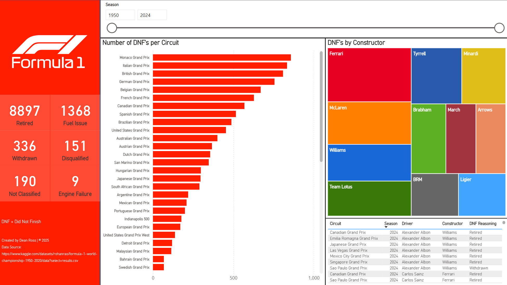

# F1 DNF Analytics Dashboard

An interactive Formula 1 analytics dashboard analysing Did Not Finish 
(DNF) incidents across every season from 1950 to 2024. Built with 
MySQL and Power BI, the dashboard allows users to explore failure 
patterns by circuit, constructor, driver, and season range.

## Dashboard Preview

## Tools & Technologies
- **MySQL** — data storage and transformation
- **Power BI** — interactive dashboard with dynamic filtering

## Data Source
- [Kaggle — Formula 1 World Championship 1950–2020](https://www.kaggle.com/datasets/rohanrao/formula-1-world-championship-1950-2020)

## Dashboard Features
- **Season range slider** — filter from any year between 1950 and 2024
- **DNFs per Circuit** — ranked bar chart of most incident-prone circuits
- **DNFs by Constructor** — treemap showing which teams retired most
- **DNF Reasoning breakdown** — retired, fuel issue, withdrawn, 
  disqualified, not classified, engine failure
- **Drill-down table** — circuit, season, driver, constructor and 
  DNF reason per incident

## Key Insights
- Monaco Grand Prix has the highest DNF count of any circuit
- Ferrari leads all constructors in total DNFs historically
- 8,897 retirements recorded across 74 seasons of racing

## How to Run
1. Extract `data/F1 Dataset.rar`
2. Run `sql/f1_data.sql` to load data into MySQL
3. Connect Power BI to your MySQL instance
4. Open `dashboard/F1_dashboard.pbix`

